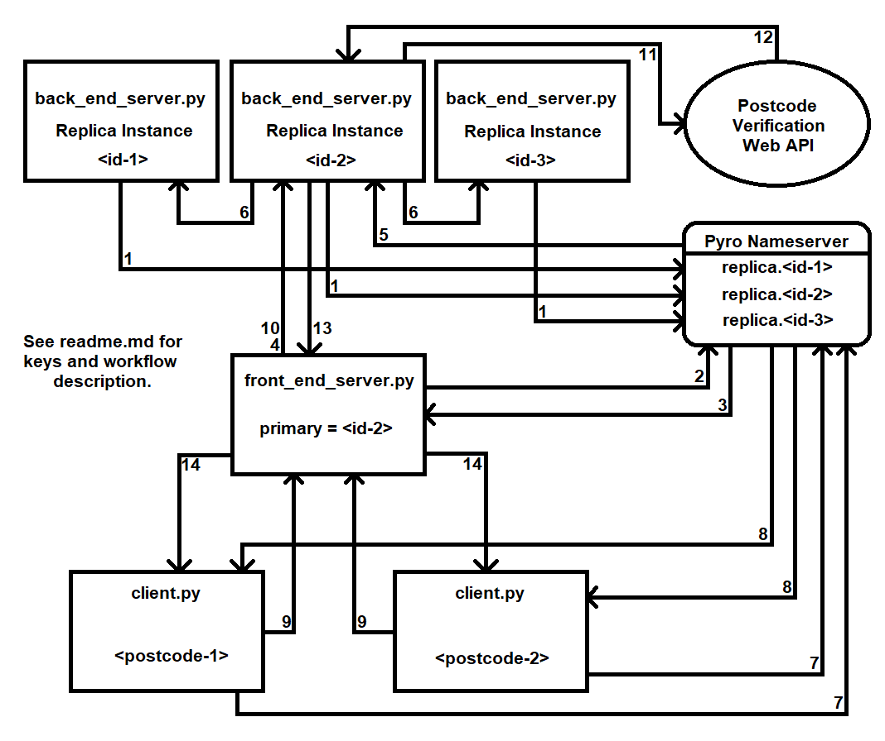

[comment]: <> (Recommended viewing through a Markdown renderer)
# Distributed Systems Assignment - Just Hungry
## Introduction
'Just Hungry' is a distributed system designed to handle food order and delivery.

## Setup and Usage
### Requirements
Python 3.5+ with Pyro4 installed, this can be done using `pip install Pyro4`.

An internet connection is required to access the [postcodes.io](http://postcodes.io) and [getthedata.com](http://getthedata.com) APIs (for postcode validation).

### Usage
Firstly, a Pyro nameserver is required (to assist with transparency), on Windows this can be done on the command line as follows:
```
> set PYRO_NS_AUTOCLEAN=20.0
> pyro4-ns
```
or
```
> set PYRO_NS_AUTOCLEAN=20.0
> python -m Pyro4.naming
```
On unix:
```
$ export PYRO_NS_AUTOCLEAN=20.0
$ pyro-ns
```
or
```
$ export PYRO_NS_AUTOCLEAN=20.0
$ python -m Pyro4.naming
```

Setting `PYRO_NS_AUTOCLEAN=20.0` as an environment variable before starting the nameserver makes it check every 20.0 seconds whether the servers corresponding to the names it is hosting are still running, if not it removes them.

The system is designed to have an arbitrary number of replica (back-end) servers. These can be started by simply running `python back_end_server.py` as many times as required, `-h` can be used to get a list of options.

The front-end server should have a single instance run with `python front_end_server.py`.

Clients use the Pyro name server to locate the front-end server, thus no configuration is required if being run on the same machine (which can be done with `python client.py`).

The client uses a simple command-line interface to demonstrate the distributed system in action, the servers additionally output information about what they are doing.

## System Overview
### Workflow


The system's workflow can be visualised in _workflow.png_, the numbers corresponding to the image are enclosed in square brackets below.

When a replica (back-end) server is started up it registers with the nameserver [1] and checks for an active front-end server [not demonstrated in image].
If a front-end server is found the replica registers with it, the front-end server then forwards this on to the primary replica to have its initial state updated.
If there is no primary replica the front-end server sets the new replica (being registered) as the primary.

When the front-end server is started, if there are available replicas, it sets the first one found [2, 3] to be the primary replica [4].
The primary replica next updates the state of all the other available replicas to that of its own [5, 6].

From here, once the client has used the nameserver to locate the front-end server [7, 8], any client requests are routed to the primary replica [9, 10].
If required, a HTTP GET request is made to the postcode verification API [11, 12] and results are returned to the client (again via the front-end server) [13, 14].

As is required by passive replication the primary replica distributes any updated state to the other replicas registered with the nameserver [5, 6].

In the case of Just Hungry, each replica has a pre-defined (hard-coded) data set (representing order history) which is loaded on start, when a replica joins the distributed system, its pre-defined data is overwritten with the current state of the system (ensuring concurrency).
The order history data is a dictionary which maps client postcodes to a list of orders (each order consists of a list of item names stored as strings).

### Postcode Validation
When an order is made, a delivery postcode is submitted via HTTP request to the _postcodes.io_ API for validation (if this cannot be reached a request to the _getthedata.com_ API is attempted to try improve redundancy).

### Server Failure
Failure of a replica can be simulated by closing the server either with `Ctrl+C` or closing the command window/shell.
If the erroneous server is the primary one, the front-end server will automatically allocate a new primary replica (if available), the client notices no difference in the provided service.

This demonstration does not automatically re-spawn servers upon failure (although it could be easily adapted to).
Since replicas automatically register themselves with the primary replica (via the front-end server), they can be added or removed during runtime as needed without loss of data (as long as one replica is always alive due to the in-memory database model).
If the back-end server were to go down it could be brought back up with no risk to the data, however the client would need to look-up and connect with its new Pyro URI.
